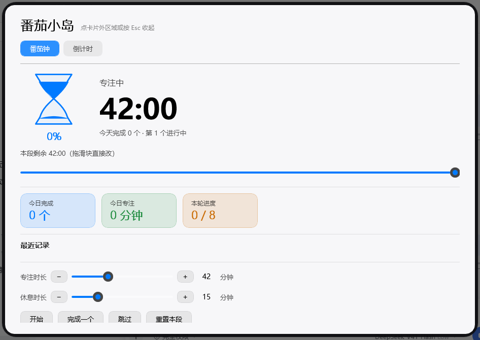
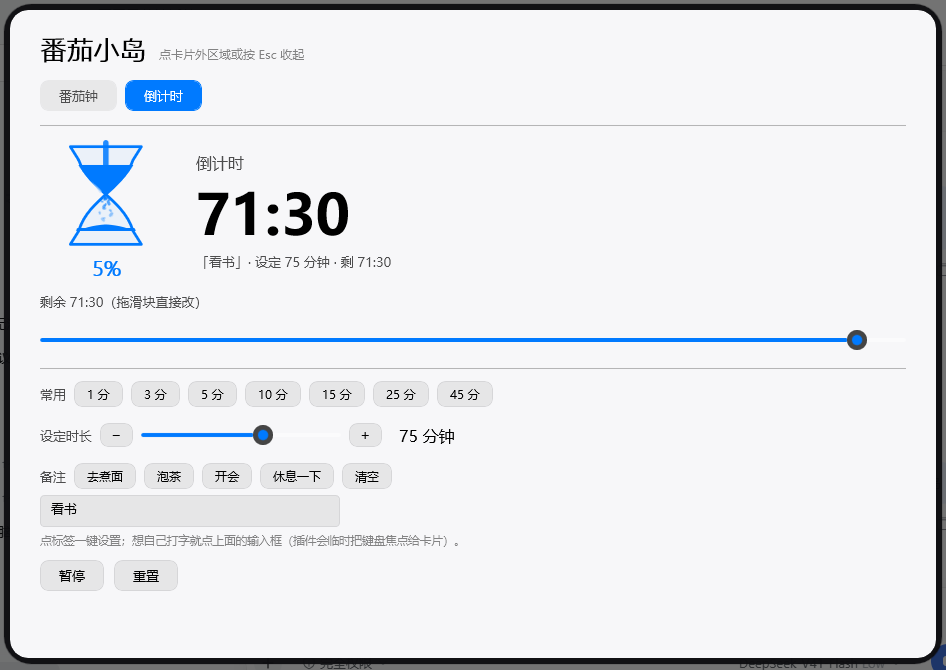

# 时钟岛 · pomodoro-island

> 装在 **WinIsland（灵动岛）** 上的番茄钟 + 随手倒计时。
> 界面照着 iOS 灵动岛做：蓝色矢量沙漏、沙子会漏、漏完会自己翻过来。


---

## ⚠️ 免责声明

**本插件是个人兴趣作品，按「现状」（AS IS）提供，不附带任何明示或暗示的担保**，包括但不限于适销性、特定用途适用性及不侵权的担保。

- 使用本插件所产生的**任何直接或间接后果**（包括但不限于：计时不准、错过提醒、耽误正事、数据丢失、系统异常、与其他软件冲突或其他任何损失），**作者不承担任何责任**。
- 番茄钟属于**效率辅助工具**，**不能**替代医疗、用药、安全、生产、考试等场景下的专业计时或提醒设备。请勿在这些场景中把它当作唯一依赖。
- 插件**不联网、不采集、不上传任何数据**；只读写 WinIsland 的插件设置，以及你自己插件目录下的 `stats.json`（今日完成数与专注时长）。
- 「结束提示音」由 Windows 系统声音提供，**能不能响取决于你的系统声音设置**（静音、专注助手、勿扰模式都会影响）。
- 你可以随时在 **WinIsland 设置 → 插件管理** 里停用或卸载本插件。卸载后如需彻底清理，请自行删除 `plugins\pomodoro-island\` 目录（内含 `stats.json`）。
- 本项目以 **MIT 许可**发布，你可以自由使用、修改、分发，但需自行承担风险。
- **继续安装或使用本插件，即表示你已阅读并接受以上说明。**

---

## 它长什么样

**一级 · 收起态**（平时挂在屏幕顶上的胶囊）

```
⌛ 看书        71:36
```

蓝色沙漏 + 备注（倒计时才显示）+ 白色大号时间。

**二级 · 展开态**（鼠标移到岛上）

```
⌛ 71:36     ( ▶ )  ( ✕ )
   倒计时
```

沙漏变大、出现阶段标签，右边两个圆钮：**蓝环 = 开始/暂停**，**深灰圆 = 重置本段**。
标签和二钮是**一层层长出来**的（逐帧动画，跟宿主同一条缓动曲线）。

**三级 · 聚光卡**（点击岛体，白色大卡片）



顶部两个页签：**番茄钟 / 倒计时**，各自一套完整控制台。

---

## 特性

### 🍅 番茄钟
- 专注 → 短休息 → 专注 → …… 每完成 N 个进一次长休息（N 可设置）
- **今日完成数 / 今日专注时长 / 本轮进度** 三张彩色统计卡
- **最近记录**（最近 5 条）
- 开始 / 完成一个 / 跳过 / 重置本段

### ⏳ 随手倒计时（「3 分钟后去煮面」）
- 任意时长（1~600 分钟），常用时长一键选
- **备注**：写「看书」「去煮面」，岛上直接显示
- 番茄钟和倒计时**各自独立计时**，可以同时跑

### ⌛ 会动的沙漏（矢量的，任何尺寸都清晰）
- 玻璃轮廓是**贝塞尔曲线**，带通透渐变和高光
- 上罩沙面**塌成漏斗形凹陷**，中间一道**沙流**，下罩堆成**锥形沙堆**
- **16 颗大小不一的沙粒飘落**：重力加速、左右飘、各自翻滚
- **沙子全部漏到底之后**，整个沙漏翻转 180° —— 漏的过程中绝不翻转

### 🔔 闹铃
- 内置 **小米「白日梦」/ vivo / 苹果「雷达」** 三个厂商铃，到点循环响
- **响铃时岛上出现 🔇 关闭按钮**，点一下立刻静音（最长响 60 秒自动停，不会吵一整夜）
- 想用自己的音频：设置里点 **「添加音频…」**，支持 mp3 / wav / ogg / m4a / aac / flac / wma
- 播不出来会自动退回系统提示音 —— 到点一定有声音

### 其它
- 所有调时间的地方都是**滑块**（± 号做单步微调）
- 岛的明暗跟随系统；卡片是独立的白色卡片
- 时间文字宽度**按字数自适应**，「120:00」这种长时长不会被裁掉
- 今日统计写入插件目录的 `stats.json`，重启不丢，跨天自动清零
- 结束时响系统提示音 + 岛上弹一条提醒

---

## 截图

| 收起态 | 展开态 |
|---|---|
|  |  |

| 倒计时页签 | 番茄钟页签 |
|---|---|
|  |  |

---

## 安装

**方式一（推荐）**：把 `pomodoro-island-1.0.0.lwp` 拖进 WinIsland 的 `plugins\` 目录，重启 WinIsland 会自动安装并删除包。

**方式二**：手动把 `plugin.json` + `PomodoroIsland.dll` + `PomodoroIsland.deps.json` 放进 `plugins\pomodoro-island\`。

装好后：**WinIsland 设置 → 插件管理 → 番茄小岛**。

> 如果岛上没显示，去 **设置 → 插件 → 番茄小岛 → 显示优先级** 调高一点（宿主内置媒体模块是 200）。

---

## 设置

全部集中在 **WinIsland 设置 → 插件 → 番茄小岛**，分四组：

| 分类 | 设置项 | 默认 |
|---|---|---|
| 专注时间 | 专注 / 短休息 / 长休息 / 长休息间隔 | 25 / 5 / 15 分钟、4 个 |
| 倒计时 | 默认时长、默认备注 | 10 分钟、空 |
| 提醒 | 自动开始下一段 / 结束提示音 / **闹铃选择（可试听、可添加音频）** / 结束时在岛上弹提示 | 全开、小米白日梦 |
| 显示 | 显示优先级（0~200） | 60 |

---

## 从源码构建

需要 **.NET 10 SDK**（项目里的 `global.json` 会把它钉死在 .NET 10，别删）。

```powershell
cd pomodoro-island
dotnet build          # 编译并自动拷进 WinIsland 的 plugins\pomodoro-island\
```

`PomodoroIsland.csproj` 里的 `WinIslandPluginsDir` 指向你本机的 WinIsland `plugins` 目录，按需改。

---

## 已知限制

- **聚光卡窗口平时不抢键盘焦点**（宿主的设计，这样不打扰你正在用的软件）。所以卡片里的输入框默认打不了字 —— 插件做了处理：**点输入框那一刻主动把卡片窗口抢到前台**，打字和输入法都能用。
- **无法接入 Windows「闹钟和时钟」应用**：那个应用没有对外接口，第三方程序既读不到它设的闹钟，也不能替它设。到点提醒由插件自己完成（提示音 + 岛上提示）。
- 聚光卡高度受宿主限制（工作区 92%），内容多时可滚动。
- 部分动画是装饰性的（沙漏循环），不代表精确剩余进度；精确进度看时间数字、百分比和滑块。

---

## 目录结构

| 文件 | 作用 |
|---|---|
| `PomodoroPlugin.cs` | 插件入口：装配引擎与视图、每秒驱动计时、设置页、结束提示 |
| `PomodoroEngine.cs` | 番茄钟状态机（纯逻辑，不碰界面） |
| `CountdownTimer.cs` | 任意时长倒计时（带备注） |
| `HourglassView.cs` | 会漏沙、会翻转的矢量沙漏（岛和卡片共用） |
| `PomodoroIslandView.cs` | 岛上的视图（收起 / 展开两态 + 逐帧变形动画） |
| `PomodoroSpotlightView.cs` | 聚光卡（页签 / 滑块 / 统计卡 / 备注输入） |
| `PomodoroStore.cs` | 今日统计持久化（`stats.json`） |
| `PomodoroUi.cs` | 配色、字体与共用小控件 |

---

## 许可

MIT
